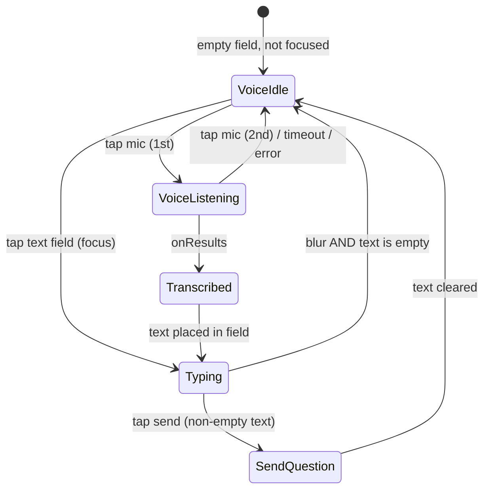

# Voice Input — Chat Page Implementation Spec

Implementation spec for adding voice input to the Chat screen in **Catechism AI**, adapted from `android-voice-input.skill` to this app's Jetpack Compose + Hilt architecture. Domain parsing is **not** required: speech is transcribed into the question field and sent through the existing `sendQuestion` path.

---

## 1. Goals

| Goal | Detail |
|------|--------|
| Voice-first entry | Mic icon is the default trailing action in the input bar (no FAB). |
| Typing fallback | Focusing the text field switches the trailing action to Send. |
| Tap-to-stop | First mic tap starts capture; second mic tap stops and transcribes. |
| Safety timeout | Capture auto-stops after a max duration if the user never taps again. |
| Reuse existing flow | Transcribed text prefills the field; user taps Send → existing `ChatViewModel.sendQuestion()` (§3.5). |

**Out of scope:** floating FAB, third-party STT SDKs, wake-word / always-on listening, voice settings screen.

---

## 2. Current Baseline

| Area | Today |
|------|--------|
| Input UI | `MessageInputBar` in `ChatScreen.kt` — `OutlinedTextField` + circular Send `IconButton` |
| Send logic | `ChatViewModel.sendQuestion(String)` |
| Permissions | `AndroidManifest.xml` has only `INTERNET` and `ACCESS_NETWORK_STATE` — no `RECORD_AUDIO` |
| Compose icons | `app/build.gradle.kts` includes `material3` only — **not** `material-icons-extended`; `Mic` is not in the core set |
| Focus plumbing | `MessageInputBar` has no `FocusRequester`, `onFocusChanged`, or `isFieldFocused` state |
| STT | None |

Relevant code today (`ChatScreen.kt`):

```kotlin
@Composable
private fun MessageInputBar(
    text: String,
    onTextChange: (String) -> Unit,
    onSend: () -> Unit,
    isEnabled: Boolean
) {
    // ... OutlinedTextField + Send IconButton (always Send today)
}
```

---

## 3. UX Specification

### 3.1 Input bar layout (unchanged structure)

```
┌─────────────────────────────────────────────────────────────┐
│  [ OutlinedTextField — "Ask about Catholic doctrine…" ] [●]│
└─────────────────────────────────────────────────────────────┘
```

- Trailing `IconButton` stays **inline** beside the field (40 dp circle, existing styling).
- **No** `FloatingActionButton`, no overlay mic.

### 3.2 Trailing button modes

| Mode | When | Icon | Button action |
|------|------|------|----------------|
| **Mic (idle)** | `inputMode == Voice` and not listening | `Icons.Default.Mic` (see §5.5) | Start listening (after permission) |
| **Mic (listening)** | `inputMode == Voice` and listening | `Icons.Default.Mic` (active styling; see §5.5) | Stop listening → transcribe |
| **Send** | `inputMode == Typing` | `Icons.AutoMirrored.Filled.Send` | Send (same rules as today) |

**Active listening styling:** primary-tinted background, optional subtle pulse or `CircularProgressIndicator` ring; `contentDescription = "Stop listening"`.

### 3.3 Mode selection rules



| Transition | Rule |
|------------|------|
| Default | `Voice` when `resolveInputMode(text, isFieldFocused) == Voice` (see §3.6) |
| → `Typing` | Field gains focus, or `text` becomes non-empty |
| → `Voice` | `text.isEmpty()` **and** field loses focus (keyboard dismissed, back pressed, or tap outside) |
| Listening + focus field | Cancel listening, switch to `Typing`, request field focus for edit |
| `isLoading == true` | Disable input bar (unchanged); if listening, force-stop via `LaunchedEffect` (§10.4) |
| After transcript | Non-blank: set `inputText`, `requestFocusAfterTranscript = true`. Blank: snackbar only, stay `Voice` |
| After send | Clear text, `focusManager.clearFocus()`, set `Voice` |

### 3.4 Placeholder copy (listening)

When listening, show a short status **above** the divider or as field supporting text:

- Listening: `"Listening… tap mic to stop"`
- Processing: `"Processing speech…"`

Hide when idle.

### 3.5 Post-transcription behavior (required for v1)

1. Set `inputText` to transcribed string (trimmed).
2. Switch to `Typing` (Send icon).
3. Call `focusRequester.requestFocus()` so the user can edit immediately.
4. **Do not auto-send.** Prefill + review is the safer first version for catechism questions (misheard doctrine terms are costly).

Optional later: Settings toggle "Send immediately after voice input."

### 3.6 Focus and mode resolution (required plumbing)

Mode must be driven by **explicit focus state**, not inferred from recomposition alone. `OutlinedTextField` does not expose `onFocusChanged` as a parameter — attach it via `Modifier.onFocusChanged` on the field modifier.

#### State variables

| State | Owner | Persist? |
|-------|-------|----------|
| `inputText` | `ChatScreen` | `rememberSaveable` |
| `isFieldFocused` | `ChatScreen` (updated via `onFieldFocusChange` from bar) | No |
| `focusRequester` | `ChatScreen` (`remember { FocusRequester() }`) — passed into `MessageInputBar` | No |
| `inputMode` | `ChatScreen` | `rememberSaveable` (optional; can be derived) |

**Recommended:** derive mode from focus + text instead of storing a separate `inputMode` that can drift:

```kotlin
fun resolveInputMode(text: String, isFieldFocused: Boolean): InputMode = when {
    text.isNotEmpty() || isFieldFocused -> InputMode.Typing
    else -> InputMode.Voice
}
```

Place `resolveInputMode` in `InputMode.kt` — unit-testable without Compose.

#### Focus primitives

`FocusRequester` is **always hoisted in `ChatScreen`** and passed into `MessageInputBar` as a parameter. `ChatScreen` must own it so post-transcript focus (`requestFocusAfterTranscript`) can target the same requester attached to the field.

```kotlin
// MessageInputBar.kt — focusRequester is a parameter from ChatScreen

OutlinedTextField(
    value = text,
    onValueChange = onTextChange,
    modifier = Modifier
        .weight(1f)
        .focusRequester(focusRequester)
        .onFocusChanged { focusState ->
            onFieldFocusChange(focusState.isFocused)
            if (focusState.isFocused && voiceState is VoiceInputState.Listening) {
                onCancelVoice() // user chose typing mid-capture
            }
        },
    // ...
)
```

```kotlin
// ChatScreen.kt
val focusRequester = remember { FocusRequester() }
var isFieldFocused by remember { mutableStateOf(false) }
val focusManager = LocalFocusManager.current
val inputMode = resolveInputMode(inputText, isFieldFocused)

// After non-blank transcript (see §10.1 guard):
LaunchedEffect(requestFocusAfterTranscript) {
    if (requestFocusAfterTranscript) {
        focusRequester.requestFocus()
        requestFocusAfterTranscript = false
    }
}

// After send:
onSend = {
    viewModel.sendQuestion(inputText)
    inputText = ""
    focusManager.clearFocus() // isFieldFocused → false → Voice mode
}
```

#### Keyboard dismiss

When the user dismisses the keyboard (back gesture, IME close):

- `onFocusChanged(isFocused = false)` fires → if `text.isEmpty()`, mode returns to `Voice` (mic).
- If `text` is non-empty, stay in `Typing` (Send stays visible) even without focus — matches standard chat apps.

#### Rotation

- `rememberSaveable` for `inputText`.
- Do **not** save `isFieldFocused` or active listening across process death; on recreate, default to `Voice` when empty.
- Active listening does not survive rotation — cancel in `DisposableEffect.onDispose`; user retaps mic.

---

## 4. Voice Capture Behavior

### 4.1 Tap-to-stop (required)

| Tap | Action |
|-----|--------|
| 1st (idle) | Request permission if needed → `startListening()` |
| 2nd (listening) | `stopListening()` → `Processing` → wait for `onResults` / `onError` (with finalization timeout — §4.4) |

Use `speechRecognizer.stopListening()`, not `cancel()`, so partial audio is finalized. On `stopListening()`, transition UI to `Processing` and disable the mic button until the session completes or times out.

### 4.2 Auto-stop timeout (required)

| Constant | Value | Rationale |
|----------|-------|-----------|
| `VOICE_CAPTURE_MAX_MS` | **30_000** (30 s) | Matches common STT limits; configurable in code |

On timeout:

1. Call `stopListening()` (same as 2nd tap).
2. If `onResults` returns blank → `onTranscript` guard in §10.1 shows snackbar "No speech detected"; no `inputText` or focus change.
3. Return UI to Mic idle.

Implementation: capture timeout `Job` owned by `VoiceInputController` (§5.6) — **not** started from bare composition callbacks or `LaunchedEffect` in `ChatScreen`.

### 4.4 Finalization timeout after `stopListening()` (required)

After `stopListening()`, the controller enters `Processing` and waits for `onResults` or `onError`. On some devices, neither callback arrives and the mic stays disabled indefinitely.

| Constant | Value | Rationale |
|----------|-------|-----------|
| `FINALIZATION_MAX_MS` | **5_000** (5 s) | Short safety net after stop; 3–5 s acceptable — use 5 s default |

When `stopListening()` is called (second mic tap, capture timeout, or loading cancel):

1. Set state to `Processing`.
2. Call `service.stopListening()`.
3. Start `finalizationTimeoutJob = scope.launch { delay(FINALIZATION_MAX_MS) }`.
4. On `onResults` / `onError`: cancel `finalizationTimeoutJob`, handle result, set `Idle`.
5. If finalization timeout fires while still `Processing`: call `service.cancel()`, set `Idle`, invoke `onError("No speech detected")` (snackbar via §10.1).

Cancel `finalizationTimeoutJob` in `destroy()` and when starting a new `startListening()`.

### 4.3 Partial results (optional v1)

`onPartialResults` may update a ephemeral `partialTranscript` in the field (greyed) or only in the status line. **v1:** status line only; field updates on final `onResults`.

---

## 5. Architecture

### 5.1 Layering

```
ChatScreen (Compose)
    ├── MessageInputBar          ← mode + icons + events
    ├── VoiceInputController     ← Compose-friendly wrapper (remember + DisposableEffect)
    └── ChatViewModel            ← optional VoiceUiState for errors

VoiceRecognitionService        ← SpeechRecognizer lifecycle (plain Kotlin, injectable)
PermissionHandler              ← runtime RECORD_AUDIO (Compose launcher in screen)
```

**No domain parser** — pipeline is:

```
Mic tap → SpeechRecognizer → transcript String → inputText → (user taps Send) → sendQuestion()
```

### 5.2 New files

| File | Responsibility |
|------|----------------|
| `app/.../voice/VoiceRecognitionService.kt` | Create/destroy recognizer, `RecognitionListener`, start/stop, availability check |
| `app/.../voice/VoiceInputState.kt` | Sealed class: `Idle`, `Listening`, `Processing` — errors via `onError` snackbar, state returns to `Idle` (no `Error` variant in v1) |
| `app/.../voice/VoiceInputController.kt` | `@Composable rememberVoiceInputController()` — wires service to state + timeouts + `cancel()` |
| `app/.../util/ContextExtensions.kt` | `Context.findActivity()` — unwraps `ContextWrapper` for permission rationale |
| `app/.../ui/chat/InputMode.kt` | `enum class InputMode { Voice, Typing }` + `resolveInputMode()` |
| `app/.../ui/chat/components/MessageInputBar.kt` | Extract + extend current private composable; focus plumbing |

### 5.3 Modified files

| File | Change |
|------|--------|
| `app/build.gradle.kts` | Add `material-icons-extended` (or add `res/drawable/ic_mic.xml` — see §5.5) |
| `AndroidManifest.xml` | Add `RECORD_AUDIO` + `<queries>` for `RecognitionService` (baseline: network perms only today) |
| `ChatScreen.kt` | Wire controller, focus state, permission launcher; use extracted `MessageInputBar` |
| `ChatViewModel.kt` | Optional: `voiceError: String?` + `dismissVoiceError()` (or reuse `uiState.error`) |

### 5.4 Hilt

Construct `VoiceRecognitionService` inside `rememberVoiceInputController` with `LocalContext.current` (Activity context). Prefer a **non-singleton** instance per Chat screen lifecycle to avoid listener leaks. Do not use `@ApplicationContext` for `SpeechRecognizer.createSpeechRecognizer` unless device-tested.

### 5.5 Mic icon dependency (compile-time requirement)

`Icons.Default.Mic` lives in **`androidx.compose.material:material-icons-extended`**, which is **not** on the classpath today (`app/build.gradle.kts` line ~61 lists `material3` only). Without it, the mic button will not compile.

**Recommended (matches existing `Icons.Default.*` usage elsewhere):**

```kotlin
// app/build.gradle.kts — inside dependencies { }, alongside material3
implementation("androidx.compose.material:material-icons-extended")
```

The Compose BOM (`2024.04.00`) already versions this artifact — no extra version pin needed.

**Alternative (smaller APK):** add `app/src/main/res/drawable/ic_mic.xml` (Material mic vector) and use `painterResource(R.drawable.ic_mic)` in `MessageInputBar`. Only choose this if avoiding the extended icons dependency is a hard requirement.

### 5.6 `VoiceInputController` lifecycle (coroutines + disposal)

The controller must own side effects; do **not** call `stopListening()` / `cancel()` from arbitrary recompositions.

```kotlin
@Composable
fun rememberVoiceInputController(
    onTranscript: (String) -> Unit,
    onError: (String) -> Unit,
): VoiceInputController {
    val context = LocalContext.current
    val scope = rememberCoroutineScope()

    // Stable callbacks — avoid stale closures when recognizer fires async
    val onTranscriptState by rememberUpdatedState(onTranscript)
    val onErrorState by rememberUpdatedState(onError)

    // Key on context — recreates controller if LocalContext.current changes without full disposal
    val controller = remember(context) {
        VoiceInputController(
            scope = scope,
            createService = { callbacks ->
                // Activity context from LocalContext; main-thread create (§7.5)
                VoiceRecognitionService(context, callbacks)
            },
            onTranscript = { onTranscriptState(it) },
            onError = { onErrorState(it) },
        )
    }

    DisposableEffect(controller) {
        onDispose { controller.destroy() }
    }

    return controller
}
```

**`VoiceInputController` internals:**

| Responsibility | Detail |
|----------------|--------|
| `captureTimeoutJob` | `scope.launch { delay(CAPTURE_MAX_MS); stopListening() }` — started in `startListening()`; set to `null` after cancel/completion (§10.3) |
| `finalizationTimeoutJob` | `scope.launch { delay(FINALIZATION_MAX_MS) }` — started in `Processing`; set to `null` after cancel/completion; on fire → `cancel()` + `Idle` + `onError` (§4.4) |
| State | `mutableStateOf<VoiceInputState>` exposed as `val state: State<VoiceInputState>` |
| Toggle | `onMicClick()`: if `Listening` → `stopListening()` else if `Idle` → availability check then `startListening()`; ignore while `Processing` |
| `cancel()` | Abrupt stop (loading guard, focus-while-listening): cancel both jobs, `service.cancel()`, `_state = Idle` — does **not** wait for `onResults` (§10.3) |
| `isRecognitionAvailable` | Exposed read-only; `SpeechRecognizer.isRecognitionAvailable(context)` — checked in `startListening()` and at mic click (§8, §10.1) |
| No compose in service callbacks | Service `RecognitionListener` posts to controller methods only; controller updates state and invokes `rememberUpdatedState` callbacks |
| Main thread | All `create` / `startListening` / `stopListening` / `cancel` / `destroy` calls go through service methods that assert main thread (§7.5) |

**Loading guard (ChatScreen only):**

```kotlin
LaunchedEffect(isEnabled, voiceController.state.value) {
    val active = voiceController.state.value
    if (!isEnabled && (active is VoiceInputState.Listening || active is VoiceInputState.Processing)) {
        voiceController.cancel()
    }
}
```

Do not put `voiceController.cancel()` inline in `MessageInputBar` body or other composable lambdas that run every recomposition.

### 5.7 `VoiceInputState` (no `Error` variant in v1)

```kotlin
sealed class VoiceInputState {
    data object Idle : VoiceInputState()
    data object Listening : VoiceInputState()
    data object Processing : VoiceInputState()
}
```

Recognition failures, timeouts, and unavailable recognizer do **not** add an `Error` UI state. The controller calls `onError(message)` → snackbar in `ChatScreen`, then sets `_state = Idle`. This keeps the mic button rules simple (`Idle` / `Listening` / `Processing` only). A dedicated `Error` state is optional in a future version if the input bar needs inline error styling.

---

## 6. Manifest

**Current baseline** (`AndroidManifest.xml`): only `INTERNET` and `ACCESS_NETWORK_STATE`. Add the following.

```xml
<uses-permission android:name="android.permission.RECORD_AUDIO" />

<queries>
    <intent>
        <action android:name="android.speech.RecognitionService" />
    </intent>
</queries>
```

- Place `<uses-permission>` alongside existing network permissions (before `<application>`).
- Place `<queries>` as a direct child of `<manifest>` (required on API 30+ to discover speech recognition services).
- `RECORD_AUDIO` is dangerous — request at runtime on first mic tap, not at app launch.

---

## 7. `VoiceRecognitionService` (core STT)

Adapted from `android-voice-input.skill` §3; Activity/application `Context` required.

### 7.1 API

```kotlin
class VoiceRecognitionService(
    private val context: Context,
    private val callbacks: Callbacks
) {
    interface Callbacks {
        fun onReadyForSpeech()
        fun onBeginningOfSpeech()
        fun onEndOfSpeech()
        fun onRmsChanged(rmsdB: Float)
        fun onResults(transcript: String)
        fun onError(code: Int, message: String)
    }

    val isAvailable: Boolean  // SpeechRecognizer.isRecognitionAvailable(context); main thread (§7.5)
    fun startListening(locale: Locale = Locale.getDefault())
    fun stopListening()
    fun cancel()
    fun destroy()
}
```

### 7.2 Recognizer intent extras

```kotlin
Intent(RecognizerIntent.ACTION_RECOGNIZE_SPEECH).apply {
    putExtra(RecognizerIntent.EXTRA_LANGUAGE_MODEL, RecognizerIntent.LANGUAGE_MODEL_FREE_FORM)
    putExtra(RecognizerIntent.EXTRA_LANGUAGE, locale.toLanguageTag())
    putExtra(RecognizerIntent.EXTRA_MAX_RESULTS, 1)
    putExtra(RecognizerIntent.EXTRA_PARTIAL_RESULTS, true)   // optional
    // Prefer complete sentences for questions:
    putExtra(RecognizerIntent.EXTRA_SPEECH_INPUT_COMPLETE_SILENCE_LENGTH_MILLIS, 1500L)
    putExtra(RecognizerIntent.EXTRA_SPEECH_INPUT_POSSIBLY_COMPLETE_SILENCE_LENGTH_MILLIS, 1500L)
}
```

Use `Locale.getDefault()` unless the app adds locale settings later.

### 7.3 Error mapping

| `SpeechRecognizer` error | User message |
|--------------------------|--------------|
| `ERROR_NO_MATCH` | No speech detected. Try again. |
| `ERROR_SPEECH_TIMEOUT` | Listening timed out. |
| `ERROR_NETWORK` / `ERROR_NETWORK_TIMEOUT` | Network error. Check connection. |
| `ERROR_AUDIO` | Microphone error. |
| `ERROR_INSUFFICIENT_PERMISSIONS` | Microphone permission required. |
| `ERROR_RECOGNIZER_BUSY` | Busy — try again. |
| Other | Could not recognize speech. |

### 7.4 Lifecycle

- Create recognizer when Chat screen enters composition (or first mic tap).
- `destroy()` in `DisposableEffect.onDispose` and when `ChatScreen` leaves composition.
- Never hold a destroyed recognizer; recreate if needed after destroy.
- All lifecycle calls must run on the **main thread** (§7.5).

### 7.5 Main-thread requirement

`SpeechRecognizer` is main-thread-sensitive. The following must run on the main looper:

- `SpeechRecognizer.isRecognitionAvailable(context)`
- `SpeechRecognizer.createSpeechRecognizer(context)`
- `startListening(intent)`
- `stopListening()`
- `cancel()`
- `destroy()`

`RecognitionListener` callbacks (`onResults`, `onError`, etc.) are already delivered on the main thread.

**Implementation notes:**

```kotlin
// VoiceRecognitionService.kt
private fun ensureMainThread() {
    check(Looper.myLooper() == Looper.getMainLooper()) {
        "SpeechRecognizer must be used on the main thread"
    }
}

fun startListening(...) { ensureMainThread(); speechRecognizer?.startListening(intent) }
// same guard on create, stopListening, cancel, destroy
```

Compose click handlers and `rememberCoroutineScope()` without a custom dispatcher run on main — safe for mic taps. If any controller work moves to `Dispatchers.IO`, **post back to main** before touching `SpeechRecognizer`:

```kotlin
scope.launch(Dispatchers.Main.immediate) { service.stopListening() }
```

Use `LocalContext.current` (Activity context when composed under `MainActivity`) for `createSpeechRecognizer` — not a background `applicationContext` wrapper unless tested on target devices.

---

## 8. Permissions and availability (Compose)

`shouldShowRequestPermissionRationale` is an **`Activity`** API — not available from plain `Context`. `LocalContext.current` may be a themed `ContextWrapper`, so resolve the Activity via `findActivity()` (§8.1).

**Do not** cache `hasRecordAudioPermission` / `shouldShowRationale` as composition `val`s — they go stale after the permission launcher returns. Re-read permission state **inside `onMicClick()`** (or keep an explicit `var hasMicPermission` updated by the launcher callback).

### 8.1 `Context.findActivity()` helper

```kotlin
// app/.../util/ContextExtensions.kt
import android.app.Activity
import android.content.Context
import android.content.ContextWrapper

fun Context.findActivity(): Activity? {
    var ctx: Context = this
    while (ctx is ContextWrapper) {
        if (ctx is Activity) return ctx
        ctx = ctx.baseContext
    }
    return ctx as? Activity
}
```

### 8.2 Mic click handler (permission + availability at click time)

`!shouldShowRationale` is **true both before the first request and after permanent denial** — track whether a request has completed with `hasRequestedMicPermission` (`rememberSaveable`).

```kotlin
val context = LocalContext.current
var hasRequestedMicPermission by rememberSaveable { mutableStateOf(false) }

val permissionLauncher = rememberLauncherForActivityResult(
    ActivityResultContracts.RequestPermission(),
) { granted ->
    hasRequestedMicPermission = true  // at least one system dialog has completed
    if (granted) {
        voiceController.startListening()
    } else {
        snackbarScope.launch {
            snackbarHostState.showSnackbar("Microphone access is needed for voice input.")
        }
    }
}

val onMicClick: () -> Unit = micClick@{
    when (voiceController.state.value) {
        is VoiceInputState.Listening -> voiceController.stopListening()
        is VoiceInputState.Processing -> return@micClick
        else -> {
            if (!voiceController.isRecognitionAvailable) {
                snackbarScope.launch {
                    snackbarHostState.showSnackbar(
                        "Speech recognition not available on this device."
                    )
                }
                return@micClick
            }

            val granted = ContextCompat.checkSelfPermission(
                context,
                Manifest.permission.RECORD_AUDIO,
            ) == PackageManager.PERMISSION_GRANTED

            if (granted) {
                voiceController.startListening()
                return@micClick
            }

            val activity = context.findActivity()
            if (activity == null) {
                snackbarScope.launch {
                    snackbarHostState.showSnackbar("Unable to request microphone permission.")
                }
                return@micClick
            }

            val showRationale = ActivityCompat.shouldShowRequestPermissionRationale(
                activity,
                Manifest.permission.RECORD_AUDIO,
            )

            when {
                showRationale -> {
                    showPermissionRationaleDialog()  // on confirm → permissionLauncher.launch(...)
                }
                hasRequestedMicPermission -> {
                    // Denied at least once and rationale suppressed → "Don't ask again"
                    showOpenMicSettingsDialog()  // ACTION_APPLICATION_DETAILS_SETTINGS
                }
                else -> {
                    permissionLauncher.launch(Manifest.permission.RECORD_AUDIO)
                }
            }
        }
    }
}
```

Required imports: `androidx.core.app.ActivityCompat`, `androidx.core.content.ContextCompat`.

Pass `isVoiceInputAvailable = voiceController.isRecognitionAvailable` to `MessageInputBar` to **disable** the mic when recognition is unavailable (§9.3). Snackbar on click is still shown as a fallback if state is stale.

---

## 9. `MessageInputBar` — detailed contract

### 9.1 Parameters

```kotlin
@Composable
fun MessageInputBar(
    text: String,
    onTextChange: (String) -> Unit,
    onSend: () -> Unit,
    isEnabled: Boolean,
    inputMode: InputMode,              // pass resolveInputMode(text, isFieldFocused) from parent
    onFieldFocusChange: (Boolean) -> Unit,
    onCancelVoice: () -> Unit,          // field focused during listening → voiceController.cancel()
    focusRequester: FocusRequester,     // hoisted in ChatScreen; required for post-transcript focus
    voiceState: VoiceInputState,
    isVoiceInputAvailable: Boolean,     // disables mic when SpeechRecognizer unavailable (§8.2)
    onMicClick: () -> Unit,
    voiceStatusMessage: String?,
    modifier: Modifier = Modifier,
)
```

Remove `onInputModeChange` — mode is derived via `resolveInputMode`, not toggled imperatively (except implicit focus/text changes).

### 9.2 Text field interactions

```kotlin
OutlinedTextField(
    value = text,
    onValueChange = onTextChange,
    modifier = Modifier
        .weight(1f)
        .focusRequester(focusRequester)
        .onFocusChanged { focusState ->
            onFieldFocusChange(focusState.isFocused)
            if (focusState.isFocused && voiceState is VoiceInputState.Listening) {
                onCancelVoice()
            }
        },
    // ...
)
```

Required imports: `androidx.compose.ui.focus.focusRequester`, `androidx.compose.ui.focus.onFocusChanged`, `androidx.compose.ui.platform.LocalFocusManager` (parent).

### 9.3 Trailing button logic

```kotlin
when (inputMode) {
    InputMode.Voice -> {
        val listening = voiceState is VoiceInputState.Listening
        IconButton(
            onClick = onMicClick,
            enabled = isEnabled
                && isVoiceInputAvailable
                && voiceState !is VoiceInputState.Processing,
            // listening → primary background; idle → neutral like today's disabled send
        ) { Icon(Icons.Default.Mic, ...) }
    }
    InputMode.Typing -> {
        val isSendActive = text.trim().isNotEmpty() && isEnabled
        IconButton(onClick = onSend, enabled = isSendActive, ...) {
            Icon(Icons.AutoMirrored.Filled.Send, ...)
        }
    }
}
```

### 9.4 Loading guard

When `isEnabled == false` (`uiState.isLoading`):

- Disable field and trailing button.
- Cancel active listening via `LaunchedEffect` in `ChatScreen` (§5.6) — not inside `MessageInputBar` recomposition.

---

## 10. `ChatScreen` integration

### 10.1 Scaffold, snackbar, and state

`SnackbarHostState.showSnackbar()` is a **suspend** function — do not call it directly from `onError` or other non-suspend callbacks. Use a screen-scoped coroutine:

```kotlin
val snackbarHostState = remember { SnackbarHostState() }
val snackbarScope = rememberCoroutineScope()

Scaffold(
    snackbarHost = { SnackbarHost(snackbarHostState) },
    topBar = { /* existing TopAppBar */ },
) { paddingValues ->
    // ...
}
```

```kotlin
var inputText by rememberSaveable { mutableStateOf("") }
var isFieldFocused by remember { mutableStateOf(false) }
var requestFocusAfterTranscript by remember { mutableStateOf(false) }

val focusRequester = remember { FocusRequester() }  // hoisted here; passed to MessageInputBar
val focusManager = LocalFocusManager.current
val inputMode = resolveInputMode(inputText, isFieldFocused)

val voiceController = rememberVoiceInputController(
    onTranscript = { transcript ->
        val trimmed = transcript.trim()
        if (trimmed.isBlank()) {
            snackbarScope.launch {
                snackbarHostState.showSnackbar("No speech detected")
            }
            // do not set inputText or request focus — stay in Voice when field is empty
        } else {
            inputText = trimmed
            requestFocusAfterTranscript = true  // Typing mode follows from non-empty text + focus
        }
    },
    onError = { msg ->
        snackbarScope.launch { snackbarHostState.showSnackbar(msg) }
    },
)

LaunchedEffect(requestFocusAfterTranscript) {
    if (requestFocusAfterTranscript) {
        focusRequester.requestFocus()
        requestFocusAfterTranscript = false
    }
}

MessageInputBar(
    // ...
    focusRequester = focusRequester,
    onFieldFocusChange = { isFieldFocused = it },
    onCancelVoice = { voiceController.cancel() },
    isVoiceInputAvailable = voiceController.isRecognitionAvailable,
    onMicClick = onMicClick,  // §8.2 — permission + availability at click time
)
```

### 10.2 Send (unchanged semantics)

```kotlin
onSend = {
    viewModel.sendQuestion(inputText)
    inputText = ""
    focusManager.clearFocus()  // → isFieldFocused false → Voice mode when empty
}
```

### 10.3 Timeout wiring (inside `VoiceInputController` only)

```kotlin
// VoiceInputController.kt — not in ChatScreen; all service calls on main thread (§7.5)
private var captureTimeoutJob: Job? = null
private var finalizationTimeoutJob: Job? = null

val isRecognitionAvailable: Boolean
    get() = service.isAvailable

fun startListening() {
    if (_state.value !is VoiceInputState.Idle) return
    if (!service.isAvailable) {
        onError("Speech recognition not available on this device.")
        return
    }
    captureTimeoutJob?.cancel()
    captureTimeoutJob = null
    finalizationTimeoutJob?.cancel()
    finalizationTimeoutJob = null
    _state.value = VoiceInputState.Listening
    service.startListening()
    captureTimeoutJob = scope.launch {
        delay(VoiceInputConfig.CAPTURE_MAX_MS)
        if (_state.value is VoiceInputState.Listening) {
            stopListening()
        }
    }
}

fun stopListening() {
    if (_state.value !is VoiceInputState.Listening) return
    captureTimeoutJob?.cancel()
    captureTimeoutJob = null
    _state.value = VoiceInputState.Processing
    service.stopListening()
    startFinalizationTimeout()
}

private fun startFinalizationTimeout() {
    finalizationTimeoutJob?.cancel()
    finalizationTimeoutJob = scope.launch {
        delay(VoiceInputConfig.FINALIZATION_MAX_MS)
        if (_state.value is VoiceInputState.Processing) {
            service.cancel()
            _state.value = VoiceInputState.Idle
            onError("No speech detected")
        }
        finalizationTimeoutJob = null
    }
}

private fun completeRecognition(
    onSuccess: () -> Unit,
) {
    captureTimeoutJob?.cancel()
    captureTimeoutJob = null
    finalizationTimeoutJob?.cancel()
    finalizationTimeoutJob = null
    onSuccess()
    _state.value = VoiceInputState.Idle
}

// Called from RecognitionListener:
// completeRecognition { onTranscript(transcript) }  or  completeRecognition { onError(msg) }

/** Abrupt stop — loading guard, focus-while-listening. Does not enter Processing. */
fun cancel() {
    captureTimeoutJob?.cancel()
    captureTimeoutJob = null
    finalizationTimeoutJob?.cancel()
    finalizationTimeoutJob = null
    service.cancel()
    _state.value = VoiceInputState.Idle
}

fun destroy() {
    captureTimeoutJob?.cancel()
    captureTimeoutJob = null
    finalizationTimeoutJob?.cancel()
    finalizationTimeoutJob = null
    service.cancel()
    service.destroy()
}
```

**Job nulling (polish):** after every `job?.cancel()`, assign `job = null` so tests and debuggers can tell no timeout is active. Not required for correctness, but recommended consistently in `startListening`, `stopListening`, `completeRecognition`, `cancel`, `destroy`, and at the end of the finalization coroutine.

### 10.4 Side-effect placement rules

| Action | Where | Never |
|--------|-------|-------|
| Start/stop listening | `VoiceInputController` methods (mic click, toggle) | Composable body / `onTextChange` |
| Capture / finalization `delay` | Controller `scope.launch` (`captureTimeoutJob`, `finalizationTimeoutJob`) | `viewModelScope` in `ChatViewModel` |
| `SpeechRecognizer` calls | Main thread via Compose scope or `Dispatchers.Main` | `Dispatchers.IO` or background threads |
| `cancel()` on loading / focus-while-listening | `voiceController.cancel()` via `LaunchedEffect` or `onCancelVoice` | Inline in composable body; do not use `stopListening()` for abrupt cancel |
| Request focus after transcript | `LaunchedEffect(requestFocusAfterTranscript)` in `ChatScreen` | `focusRequester.requestFocus()` inside `onTranscript` directly |
| Voice error / blank transcript snackbar | `snackbarScope.launch { snackbarHostState.showSnackbar(...) }` | Direct `showSnackbar()` in non-suspend callback |
| `destroy()` recognizer | `DisposableEffect(onDispose)` in `rememberVoiceInputController` | `onCleared` unless screen-scoped |

---

## 11. `ChatViewModel` changes (minimal)

**Option A (recommended):** Keep voice errors in the Composable — `SnackbarHost` on `Scaffold`, `SnackbarHostState`, and `snackbarScope.launch { showSnackbar() }` (§10.1). No ViewModel change.

**Option B:** Extend `ChatUiState`:

```kotlin
data class ChatUiState(
    val isLoading: Boolean = false,
    val pendingQuestion: String? = null,
    val error: String? = null,
    val voiceError: String? = null,  // optional
)
```

Voice errors should **not** block chat; dismiss independently of doctrinal answer errors.

---

## 12. Edge Cases

| Scenario | Behavior |
|----------|----------|
| `SpeechRecognizer.isRecognitionAvailable() == false` | `isVoiceInputAvailable = false` disables mic; `onMicClick` + `startListening()` snackbar fallback (§8.2) |
| User taps mic while loading | Ignored (`isEnabled == false`) |
| User navigates away while listening | `DisposableEffect` → `cancel()` + `destroy()` |
| Transcript empty after stop | Snackbar "No speech detected"; do not set `inputText` or request focus; stay `Voice` (§10.1 guard) |
| User types while listening | Focus → cancel listening → `Typing` |
| Rotation | `rememberSaveable` for `inputText` only; cancel listening on dispose; empty field → `Voice` |
| Keyboard dismissed, empty text | `isFieldFocused = false` → `resolveInputMode` → `Voice` (mic returns) |
| Keyboard dismissed, non-empty text | Stays `Typing` (Send visible) |
| Bluetooth mic / brief silence | Rely on platform VAD + app 30 s cap |
| No Google speech services (some devices) | `isRecognitionAvailable()` false path |
| Permanent mic denial | `hasRequestedMicPermission && !showRationale` → `showOpenMicSettingsDialog()` (§8.2) |
| `onResults` / `onError` never after `stopListening()` | `finalizationTimeoutJob` (5 s) → `cancel()`, `Idle`, snackbar "No speech detected" (§4.4) |

---

## 13. Accessibility

| Element | `contentDescription` |
|---------|----------------------|
| Mic idle | "Start voice input" |
| Mic listening | "Stop voice input" |
| Send | "Send" (unchanged) |
| Status line | `Modifier.semantics { liveRegion = LiveRegionMode.Polite }` |

---

## 14. Testing Plan

### 14.1 Unit tests

| Test | Approach |
|------|----------|
| Mode transitions | `resolveInputMode(text, isFieldFocused)` — table tests for empty/focus/non-empty combos |
| Focus during listening | `onCancelVoice()` invoked; controller `cancel()`; mode → `Typing` |
| Blank transcript | `onTranscript` guard: no `inputText` update, no focus request, snackbar shown |
| Capture timeout job | Fake service + coroutine test: after 30 s, `stopListening()` called |
| Finalization timeout job | After `stopListening()`, if no callback within 5 s, `cancel()` + `Idle` + `onError` |
| `cancel()` | Jobs cancelled, `service.cancel()`, state `Idle`; does not enter `Processing` |
| `startListening()` when unavailable | Returns early, `onError` invoked; no state change |
| Error mapping | Table-driven tests for `mapSpeechError(code)` |

Mock `VoiceRecognitionService`; do not use real `SpeechRecognizer` in unit tests.

### 14.2 Manual / instrumented

| # | Steps | Expected |
|---|--------|----------|
| 1 | Open Chat, empty field | Mic visible, not Send |
| 2 | Tap mic, grant permission, speak, tap mic | Text in field, Send visible |
| 3 | Tap Send | Question sent; mic returns after clear |
| 4 | Tap text field (empty) | Send icon even if empty (disabled) |
| 5 | Type question | Send enables |
| 6 | Clear text, dismiss keyboard | Mic returns |
| 7 | Tap mic once, wait 30 s without 2nd tap | Auto-stop; error or partial transcript |
| 8 | Deny permission once, tap mic again | Rationale dialog or Settings offer; not Settings on first-ever ask |
| 9 | Send question (loading) | Input disabled; listening cannot start |
| 10 | Airplane mode (if cloud STT) | Graceful network error |
| 11 | Stop listening; simulate missing callback (fake in unit test) | Within 5 s: `Idle`, mic enabled, "No speech detected" snackbar |

---

## 15. Implementation Order

1. **`app/build.gradle.kts`** — add `material-icons-extended` (or `ic_mic.xml` drawable)
2. **`AndroidManifest.xml`** — `RECORD_AUDIO` + `<queries>` (verify against network-only baseline)
3. **`ContextExtensions.kt`** — `findActivity()`
4. **`InputMode.kt`** — `InputMode` enum + `resolveInputMode()`
5. **`VoiceRecognitionService`** + error mapping + `isAvailable`
6. **`VoiceInputController`** + `rememberVoiceInputController()` (`scope`, capture/finalization jobs, `cancel()`, `DisposableEffect`)
7. Extract **`MessageInputBar`** — focus (`FocusRequester`, `onFocusChanged`), dual trailing button, `isVoiceInputAvailable`
8. **`ChatScreen`** — `onMicClick` (§8.2), permission launcher, hoisted focus state, `LaunchedEffect` loading guard
9. Wire transcript → `inputText` (no auto-send) → user Send → `sendQuestion`
10. Unit tests: `resolveInputMode`, `cancel()`, error mapping, timeout job cancellation
11. Manual QA on physical device (emulator STT is unreliable)

---

## 16. Acceptance Criteria

- [ ] Project compiles with mic icon (`material-icons-extended` or `ic_mic` drawable).
- [ ] Mic is the default trailing control when the field is empty and unfocused.
- [ ] No FAB anywhere on Chat.
- [ ] Focusing the text field switches to Send (`resolveInputMode` + `onFocusChanged`).
- [ ] Dismissing keyboard with empty text returns to mic.
- [ ] Non-empty text keeps Send visible after keyboard dismiss.
- [ ] First mic tap starts capture; second mic tap stops and transcribes.
- [ ] Capture auto-stops at 30 s without a second tap (controller-owned job).
- [ ] Transcribed text prefills `inputText`; field receives focus; **no auto-send**.
- [ ] `sendQuestion` path unchanged for typed and voice-origin questions.
- [ ] Input disabled during `uiState.isLoading`; active capture cancelled via `LaunchedEffect`.
- [ ] Blank transcript shows snackbar and leaves mic mode (no spurious focus or text).
- [ ] Voice errors use `snackbarScope.launch { showSnackbar() }`; `Scaffold` has `snackbarHost`.
- [ ] Permission denied / no recognizer / STT errors show user-visible feedback, no crash.
- [ ] Stuck `Processing` recovers within 5 s (finalization timeout); mic re-enabled.
- [ ] Recognizer + capture/finalization jobs destroyed/cancelled when leaving Chat (`DisposableEffect`).
- [ ] `SpeechRecognizer` create/start/stop/destroy only on main thread.
- [ ] `cancel()` resets to `Idle` without stuck `Processing`; used for loading guard and focus-while-listening.
- [ ] Permission checked at mic click time; `findActivity()` resolves themed `ContextWrapper`.
- [ ] Unavailable recognizer disables mic and shows snackbar if tapped.
- [ ] Permanent mic denial (`hasRequestedMicPermission && !showRationale`) opens Settings; first ask launches system dialog only.
- [ ] `VoiceInputState` has only `Idle` / `Listening` / `Processing`; errors use snackbar + `Idle`.

---

## 17. Constants (single source)

```kotlin
object VoiceInputConfig {
    const val CAPTURE_MAX_MS = 30_000L
    const val FINALIZATION_MAX_MS = 5_000L   // after stopListening(); 3_000L–5_000L acceptable
    const val PARTIAL_RESULTS_ENABLED = true  // v1: UI status only
}
```

---

## 18. Audit resolution (pre-coding checklist)

| Finding | Resolution in this plan |
|---------|-------------------------|
| `Icons.Default.Mic` may not compile | §5.5 — add `material-icons-extended` to `build.gradle.kts` or use `ic_mic.xml` |
| No focus plumbing in current `MessageInputBar` | §3.6, §9.1–9.2 — `FocusRequester`, `Modifier.onFocusChanged`, `LocalFocusManager`, `resolveInputMode()` |
| Controller coroutine/disposal discipline | §5.6, §10.3–10.4 — owned `scope`/`timeoutJob`, `rememberUpdatedState`, `DisposableEffect`; loading cancel only in `LaunchedEffect` |
| Manifest baseline incomplete | §2, §6, step 2 in §15 — explicit delta from network-only manifest |
| Do not auto-send | §3.5 — required for v1; prefill + focus + manual Send |
| `showSnackbar` is suspend | §10.1 — `snackbarScope.launch { }` + `Scaffold(snackbarHost = …)` |
| Blank transcript inconsistency | §10.1 — `trimmed.isBlank()` guard; no `inputText`/focus; snackbar only |
| `focusRequester` ownership ambiguous | §3.6, §9.1, §10.1 — always hoisted in `ChatScreen`, passed to bar |
| Stuck `Processing` if no callback | §4.4, §10.3 — `FINALIZATION_MAX_MS` (5 s) → `cancel()` + `Idle` + error |
| `shouldShowRationale` not on `Context` | §8 — `LocalContext` → `Activity` + `ActivityCompat.shouldShowRequestPermissionRationale` |
| `SpeechRecognizer` thread safety | §7.5 — main-thread-only create/start/stop/destroy; `ensureMainThread()` guard |
| `cancel()` unspecified | §10.3 — explicit `cancel()`; distinct from `stopListening()` / `destroy()` |
| Stale permission `val`s | §8.2 — re-check `checkSelfPermission` / `shouldShowRationale` inside `onMicClick` |
| `Context as Activity` fragile | §8.1 — `Context.findActivity()` walks `ContextWrapper.baseContext` |
| No-recognizer path unwired | §8.2, §10.3 — `isRecognitionAvailable` disables mic + snackbar; guard in `startListening()` |
| `return@Unit` invalid | §8.2 — labeled lambda `micClick@{ … return@micClick }` |
| Permanent denial vs first ask | §8.2 — `hasRequestedMicPermission` (`rememberSaveable`) set in launcher callback |
| Unused `VoiceInputState.Error` | §5.7 — removed; `onError` + snackbar + `Idle` |
| Timeout `Job` references linger | §10.3 — set `captureTimeoutJob` / `finalizationTimeoutJob` to `null` after cancel/completion |
| `remember { }` without context key | §5.6 — `remember(context) { VoiceInputController(...) }` |

---

This spec intentionally drops the skill's FAB layout and domain parser (`YourParserService`, `DateParserService`) — they do not apply to free-form doctrinal questions. The reusable part from `android-voice-input.skill` is **SpeechRecognizer lifecycle, permissions, and tap-to-stop**, adapted to Compose and the inline input bar UX.
